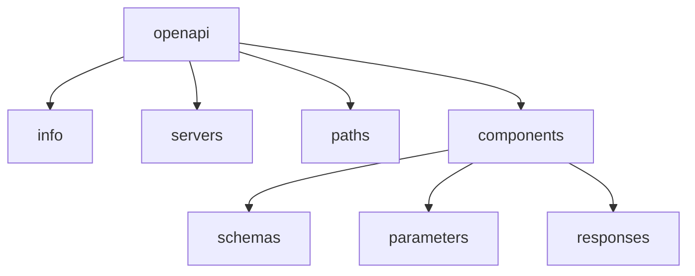
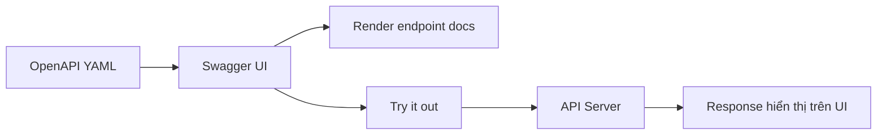

# Week 4 — OpenAPI & Swagger Documentation

## 1) Mở đầu: API Documentation là gì?
API Documentation là tài liệu mô tả cách dùng API (endpoint, input, output, auth, lỗi).

### API cần tài liệu để làm gì?
- Giúp frontend/backend/tester hiểu cùng 1 “hợp đồng API”.
- Giảm phụ thuộc trao đổi thủ công qua chat/call.
- Dễ onboarding thành viên mới.

### Vấn đề khi không có chuẩn tài liệu
- Khó hiểu endpoint nhận gì/trả gì.
- Không đồng bộ giữa code và docs.
- Tốn thời gian xác nhận lại yêu cầu.

### Machine-readable vs Human-readable
- Human-readable: tài liệu cho người đọc (Markdown, Wiki).
- Machine-readable: tài liệu cho công cụ đọc (OpenAPI YAML/JSON).

Ví dụ machine-readable:
```yaml
openapi: 3.0.3
info:
  title: Demo API
  version: 1.0.0
```

---

## 2) OpenAPI là gì?
OpenAPI Specification (OAS) là chuẩn mô tả REST API theo định dạng YAML/JSON.

### Mục tiêu
- Chuẩn hóa cách mô tả API.
- Giúp cả người và máy hiểu API thống nhất.

### Lịch sử ngắn
- Swagger Specification -> đổi tên thành OpenAPI Specification.

Ví dụ:
```yaml
openapi: 3.0.3
info:
  title: Users API
  version: 1.0.0
```

---

## 3) OpenAPI (Swagger) giải quyết vấn đề gì?
- Tự động hóa documentation.
- Đồng bộ backend & frontend qua 1 spec chung.
- Hỗ trợ generate code client/server.
- Hỗ trợ test API nhanh.

So sánh nhanh:
- Viết docs tay: dễ lệch so với code.
- Dùng OpenAPI: dễ kiểm tra, validate, generate.

Ví dụ endpoint có contract rõ:
```yaml
paths:
  /users:
    get:
      summary: Get users list
```

---

## 4) Swagger là gì?
Phân biệt:
- OpenAPI: chuẩn/spec.
- Swagger: hệ sinh thái công cụ.

Thành phần chính:
- Swagger UI: hiển thị docs tương tác.
- Swagger Editor: viết/chỉnh OpenAPI.
- Swagger Codegen: sinh code từ spec.

Ví dụ bật Swagger UI trong Flask:
```python
from flask_swagger_ui import get_swaggerui_blueprint
```

---

## 5) Tổng quan cấu trúc file OpenAPI
Một file OpenAPI thường có:
- `openapi`
- `info`
- `servers`
- `paths`
- `components`

Sơ đồ tổng quan:


Ví dụ skeleton:
```yaml
openapi: 3.0.3
info:
  title: Users API
  version: 1.0.0
servers:
  - url: /api
paths: {}
components: {}
```

---

## 6) Thành phần `paths`
`paths` mô tả các endpoint.

Ví dụ:
```yaml
paths:
  /users:
    get:
      summary: Lấy danh sách users
    post:
      summary: Tạo user mới
```

Trong mỗi path/method thường có:
- `summary`
- `parameters`
- `requestBody`
- `responses`

---

## 7) Thành phần `parameters`
Các loại parameter:
- Query parameter (`in: query`)
- Path parameter (`in: path`)
- Header parameter (`in: header`)

Ví dụ:
```yaml
parameters:
  - name: page
    in: query
    schema:
      type: integer
  - name: userId
    in: path
    required: true
    schema:
      type: integer
  - name: X-Request-Id
    in: header
    schema:
      type: string
```

---

## 8) Thành phần `requestBody`
Dùng khi API nhận dữ liệu body (thường POST/PUT/PATCH).

Cấu trúc:
- `content`
- `schema`

Ví dụ JSON body:
```yaml
requestBody:
  required: true
  content:
    application/json:
      schema:
        $ref: '#/components/schemas/UserCreateInput'
```

---

## 9) Thành phần `responses`
Mỗi response cần status code + mô tả + schema.

Status code phổ biến:
- `200`, `201`, `400`, `404`, `500`

Ví dụ:
```yaml
responses:
  '200':
    description: Thành công
    content:
      application/json:
        schema:
          $ref: '#/components/schemas/User'
  '404':
    description: Không tìm thấy user
```

---

## 10) Thành phần `components`
`components` để tái sử dụng, tránh lặp (DRY).

Các phần chính:
- `schemas`
- `parameters`
- `responses`

Ví dụ:
```yaml
components:
  schemas:
    User:
      type: object
  parameters:
    UserIdParam:
      name: userId
      in: path
      required: true
      schema:
        type: integer
```

---

## 11) `schemas` là gì?
`schemas` định nghĩa cấu trúc dữ liệu, tương tự class/model.

Ví dụ `User` schema:
```yaml
User:
  type: object
  required: [id, name, email]
  properties:
    id:
      type: integer
    name:
      type: string
    email:
      type: string
      format: email
```

---

## 12) Ví dụ hoàn chỉnh (Mini OpenAPI file)
Mini file (~20-30 dòng), có 1-2 endpoint + 1 schema:

```yaml
openapi: 3.0.3
info:
  title: Mini Users API
  version: 1.0.0
paths:
  /users:
    get:
      summary: List users
      responses:
        '200':
          description: OK
          content:
            application/json:
              schema:
                type: array
                items:
                  $ref: '#/components/schemas/User'
components:
  schemas:
    User:
      type: object
      properties:
        id:
          type: integer
        name:
          type: string
```

---

## 13) Swagger UI hoạt động như thế nào?
Input: OpenAPI file (YAML/JSON).
Output: UI tương tác (xem endpoint, thử request, xem response).

Sơ đồ:


---

## 14) Lợi ích khi dùng Swagger UI
- Test API trực tiếp ngay trên trình duyệt.
- Nhiều trường hợp không cần Postman.
- Dễ demo API cho team/product.

Ví dụ endpoint có nút `Try it out`:
```yaml
paths:
  /users/{userId}:
    get:
      summary: Get user by ID
```

---

## 15) Tổng kết
- OpenAPI = chuẩn mô tả API.
- Swagger = bộ công cụ hỗ trợ OpenAPI.
- Cần hiểu rõ: `paths`, `parameters`, `requestBody`, `responses`, `schemas`.

Ví dụ nhắc lại:
```yaml
paths:
  /users:
    post:
      requestBody: {}
      responses: {}
```

---

## 16) Chuẩn bị cho phần thực hành
Trong phần thực hành:
- Viết OpenAPI cho API đơn giản.
- Mở Swagger UI để xem kết quả và test endpoint.

Checklist:
- Spec hợp lệ OAS 3.x.
- Có ít nhất 1 schema dùng lại trong `components`.
- Có đủ status code thành công + lỗi.

---

## Gợi ý trình bày slide (quan trọng)
Mỗi phần nên có:
- 1 ví dụ YAML ngắn.
- 1 sơ đồ/hình minh họa (nếu cần).

Tránh:
- Nhồi quá nhiều code vào 1 slide.

Tỷ lệ nội dung:
- 70% concept
- 30% ví dụ
