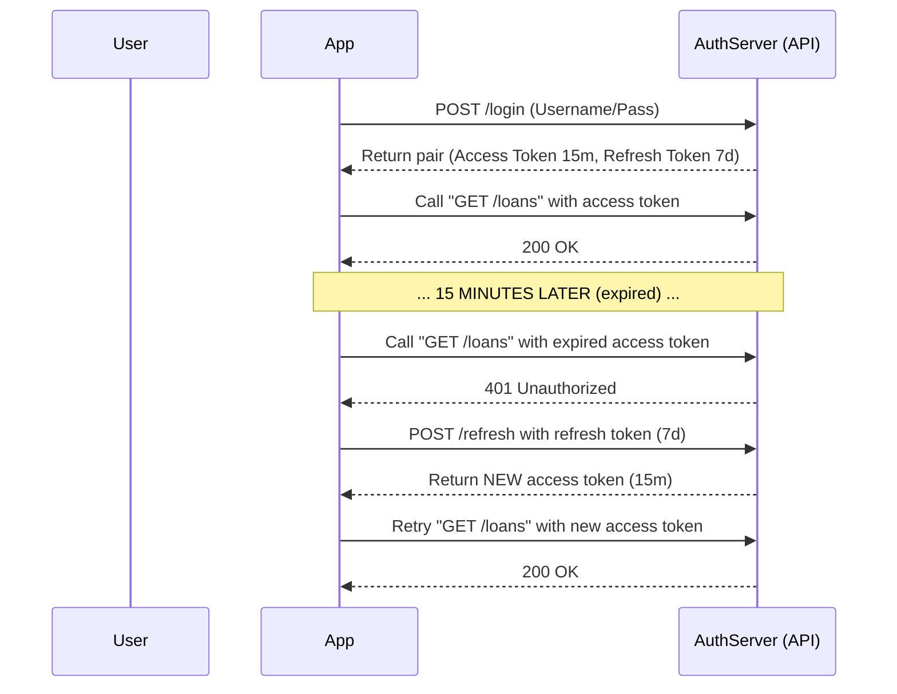

# 2. Advanced Terms and Common Security Weaknesses

A basic JWT setup is easy to implement but comes with important trade-offs. This document explains common risks and mitigation tools: refresh tokens, roles, and scopes.

---

## 2.1 Refresh Tokens and the Lifetime Problem

### What is the JWT pain point?
JWT is self-contained and validated by signature. The downside is that without server-side state, early revocation is hard: **you cannot reliably force-expire an issued JWT before `exp`**. If someone copies a valid token to another device, it may still work.

### Solution: Split trust into two tokens

To reduce leakage risk, use two token types:
1. **Access Token:**
  - Very short lifetime (for example 15 minutes or 1 hour).
  - Attached to API request headers.
  - Lower impact if leaked because it expires quickly.
2. **Refresh Token:**
  - Longer lifetime (for example 7 or 30 days).
  - Used only at `/auth/refresh` to obtain a new access token.
  - Can be revoked server-side (for example in a database) when compromise is suspected.

---

## 2.2 Roles vs Scopes in Design

In access control design, roles and scopes are often confused.

* **Roles:** What a user *is*.
  * Example: one user is `admin`, another is `member`. The role is usually stored in DB and drives coarse-grained permissions.
* **Scopes:** What a specific application/token is *allowed to do*.
  * Example: the same user may get `read+write` scopes in a web app but only `read` scope on a smartwatch app.

> [!TIP]
> In this week's FastAPI setup, scopes can be enforced directly through `Security()` dependencies.

---

## 2.3 Token Leakage and Replay Attack (Threats)

### Token Leakage
**Common cause:** storing tokens in frontend `localStorage`, which is exposed to XSS payloads.
**Mitigation:** use `HttpOnly` cookies so JavaScript cannot directly read token values.

### Replay Attack
An attacker captures a valid request or token and replays it later. If the token is still valid, the API may accept it.
**Basic mitigations:** short-lived access tokens, refresh-token rotation, `jti`/fingerprint checks, and server-side IP/device auditing.

Run the code in `week6` to see these ideas in practice.
